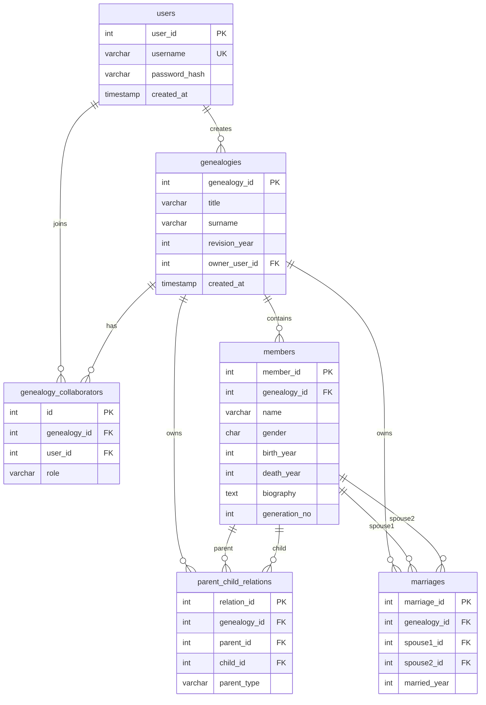

# 寻根溯源族谱管理系统 ER 图

> 本图对应 PostgreSQL 建表脚本 `交付物/sql/schema.sql`，覆盖用户、族谱、协作者、成员、亲子关系和婚姻关系。

## 关系说明

| 关系 | 类型 | 说明 |
|---|---|---|
| `users -> genealogies` | `1:N` | 一个用户可以创建多个族谱，一个族谱只有一个创建者 |
| `users -> genealogy_collaborators <- genealogies` | `M:N` | 用户可被邀请协作多个族谱，一个族谱也可有多个协作者 |
| `genealogies -> members` | `1:N` | 一个族谱包含多个成员，每个成员只属于一个族谱 |
| `members -> parent_child_relations` | `1:N` | 一个成员可以作为多个亲子关系中的父母或子女 |
| `members -> marriages` | `1:N` | 一个成员可以出现在婚姻关系的任一配偶字段中 |

## 主要约束

| 约束 | 说明 |
|---|---|
| `users.username UNIQUE` | 用户名唯一 |
| `genealogy_collaborators(genealogy_id, user_id) UNIQUE` | 避免重复协作关系 |
| `members.gender IN ('M', 'F')` | 性别取值约束 |
| `members.death_year IS NULL OR birth_year <= death_year` | 生卒年合法性 |
| `parent_child_relations.parent_id <> child_id` | 禁止自己成为自己的父母 |
| `marriages.spouse1_id <> spouse2_id` | 禁止自己与自己建立婚姻 |
| `trg_validate_parent_child` | 校验父母性别、同族谱、出生年早于子女 |
| `trg_validate_marriage` | 校验配偶存在且同族谱 |
