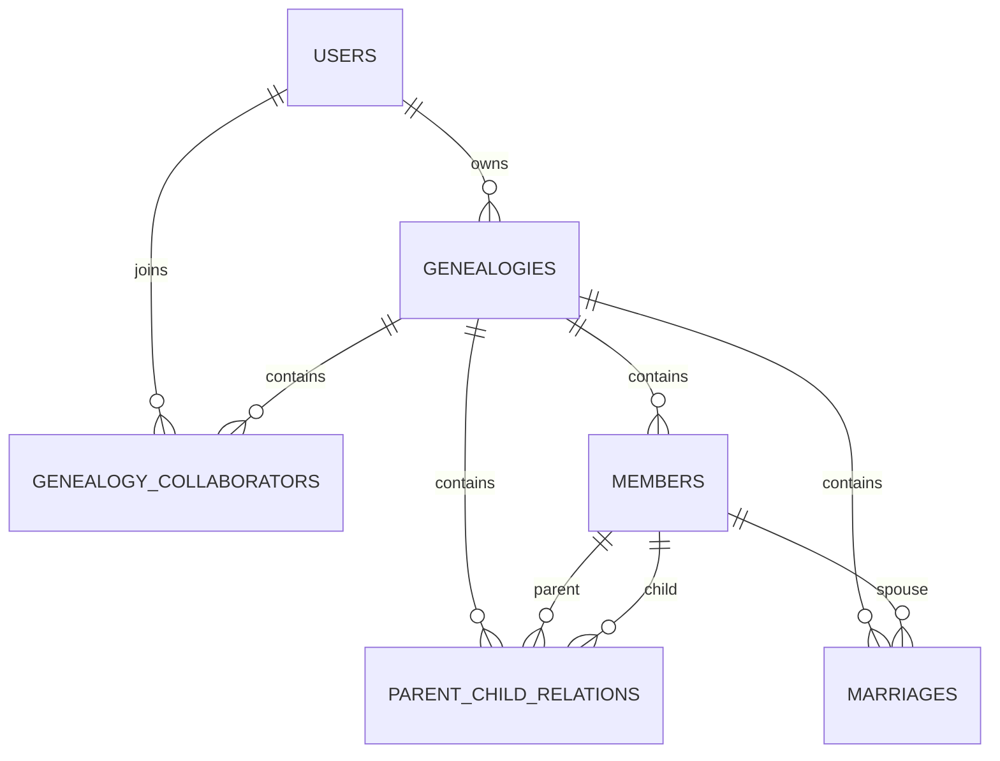

# “寻根溯源”族谱管理系统实现方案与计划

## 1. 课题目标

本项目围绕数据库应用实践课程大作业展开，目标是实现一个可演示、可扩展的族谱管理系统，覆盖以下能力：

1. 基础图形界面
   - 用户注册、登录、退出
   - 我的族谱列表
   - 族谱创建、成员维护、关系维护
   - Dashboard 统计
   - 成员姓名模糊查询
   - 树形分支预览
   - 祖先查询
   - 两成员亲缘路径查询
2. 数据库设计
   - E-R 设计
   - 关系模式设计
   - 主外键与检查约束
   - 3NF 设计说明
3. 数据工程
   - 至少 10 个族谱
   - 至少 1 个大族谱拥有 50000+ 成员
   - 总成员数达到 100000+
   - 支持 CSV 批量导入导出
4. SQL 能力
   - 配偶与子女查询
   - 递归祖先查询
   - 平均寿命分析
   - 特定条件成员筛选
   - 代际平均出生年分析
   - 四代查询与性能对比
5. 物理优化
   - 模糊查询索引
   - 亲子关系索引
   - 执行计划分析

## 2. 技术路线

- 后端：Python + Flask
- 模板引擎：Jinja2
- ORM：SQLAlchemy
- 目标数据库：PostgreSQL
- 演示数据库：SQLite
- 数据生成：Python CSV 生成脚本

选择 PostgreSQL 的原因：

- 支持递归 CTE，便于祖先与后代链路查询
- `EXPLAIN ANALYZE` 适合做性能对比
- 适合大规模 CSV 导入
- 约束、索引、触发器能力完整

## 3. 系统模块划分

### 3.1 用户与权限模块

- 用户注册、登录、退出
- 族谱拥有者与协作者权限区分

### 3.2 族谱管理模块

- 创建族谱
- 查看族谱详情
- 邀请协作者
- 删除族谱

### 3.3 成员管理模块

- 新增成员
- 编辑成员
- 删除成员
- 姓名模糊查询

### 3.4 关系管理模块

- 父子、母子关系录入
- 婚姻关系录入
- 关系校验

### 3.5 查询分析模块

- Dashboard 统计
- 树形预览
- 祖先查询
- 亲缘路径查询

### 3.6 数据工程与性能模块

- 生成 10 万级模拟数据
- 导入 CSV
- 建立索引
- 比较查询优化前后性能

## 4. 数据库设计方案

### 4.1 核心实体

1. `users`
2. `genealogies`
3. `genealogy_collaborators`
4. `members`
5. `parent_child_relations`
6. `marriages`

### 4.2 E-R 关系说明

- 一个用户可拥有多个族谱
- 一个族谱可有多个协作者
- 一个族谱包含多个成员
- 一个成员可与多个成员形成亲子关系
- 一个成员可与另一个成员形成婚姻关系

### 4.3 Mermaid E-R 图

### 4.4 规范化说明

本系统目标达到 3NF。

- 每张表只描述一个主题
- 非主属性完全依赖主键
- 不在成员表中冗余存储父母姓名、配偶姓名等可推导信息
- 协作者关系和婚姻关系独立成表，避免多值属性破坏规范化

### 4.5 约束设计

- `members.gender` 仅允许 `M` 或 `F`
- `generation_no >= 1`
- `birth_year <= death_year`
- `parent_id <> child_id`
- `spouse1_id <> spouse2_id`
- 父母与子女必须属于同一族谱
- 婚姻双方必须属于同一族谱
- 父系关系要求父母性别为男，母系关系要求父母性别为女
- 父母出生年份必须早于子女出生年份

其中跨表业务约束通过触发器实现。

## 5. SQL 实现方案

### 5.1 核心 SQL

交付脚本 `sql/queries.sql` 包含以下查询：

1. 配偶与全部子女查询
2. 递归祖先查询
3. 平均寿命最长代际统计
4. 超过 50 岁且无配偶的男性查询
5. 早于本代平均出生年的成员查询
6. 四代后代查询

### 5.2 GUI 与 SQL 的分工

- GUI 层负责输入、展示与权限控制
- SQL 层负责递归、统计和关系分析
- 应用层亲缘路径查询采用 BFS，便于演示

## 6. 索引与性能设计

建议建立以下索引：

- `members(genealogy_id, name)`
- `members(genealogy_id, generation_no)`
- `parent_child_relations(genealogy_id, parent_id)`
- `parent_child_relations(genealogy_id, child_id)`
- `marriages(genealogy_id, spouse1_id)`
- `marriages(genealogy_id, spouse2_id)`
- `members.name` 的 `pg_trgm` GIN 索引

性能测试重点：

- 在无索引条件下执行四代查询
- 创建索引后再次执行同一查询
- 对比执行计划、扫描方式和耗时

## 7. 数据生成方案

### 7.1 规模目标

- 用户：10
- 族谱：10
- 总成员：100000
- 最大族谱成员数：50000
- 每族谱代际数：30

### 7.2 生成原则

- 成员姓名按姓氏与随机名字符组合生成
- 每代成员按固定增长逻辑生成
- 亲子关系按相邻代构造
- 婚姻关系按同代成员成对构造
- 数据满足基本出生年份先后逻辑

### 7.3 产出文件

- `users.csv`
- `genealogies.csv`
- `members.csv`
- `parent_child_relations.csv`
- `marriages.csv`

## 8. 界面实现方案

界面设计目标是“可稳定演示核心功能”，不追求复杂前端框架。

建议演示页面顺序：

1. 登录页
2. 控制台
3. 创建族谱
4. 族谱详情页
5. 成员新增/编辑页
6. 关系维护页
7. 模糊查询页
8. 树形预览页
9. 祖先查询页
10. 亲缘路径页

## 9. 分阶段实施计划

### 第一阶段：需求与环境

- 明确功能范围
- 初始化 Flask 工程
- 配置数据库连接

### 第二阶段：数据库建模

- 设计 E-R 图
- 编写 `schema.sql`
- 编写索引与触发器脚本

### 第三阶段：数据工程

- 编写 `generate_data.py`
- 生成 CSV
- 准备导入脚本

### 第四阶段：SQL 查询

- 完成课程要求 SQL
- 准备性能对比 SQL

### 第五阶段：GUI 开发

- 完成注册登录
- 完成族谱和成员管理
- 完成树形预览、祖先查询、亲缘路径查询

### 第六阶段：收尾交付

- 补实验报告
- 补截图材料
- 补导出说明
- 补性能记录

## 10. 风险与应对

1. 10 万级数据不可手工录入
   - 通过脚本生成并批量导入
2. 跨表约束难用单表检查表达
   - 通过触发器完成
3. 大数据量下 GUI 演示可能变慢
   - 现场演示时准备中小规模数据
4. 答辩时截图不全
   - 提前按清单准备截图材料

## 11. 最终交付建议

最终建议提交以下内容：

- `report/实验报告.md`
- `report/性能测试记录.md`
- `report/答辩演示提纲.md`
- `sql/*.sql`
- `scripts/generate_data.py`
- `data/` 下生成好的 CSV 与说明
- `export/` 下导入导出说明
- `screenshots/截图清单.md`
