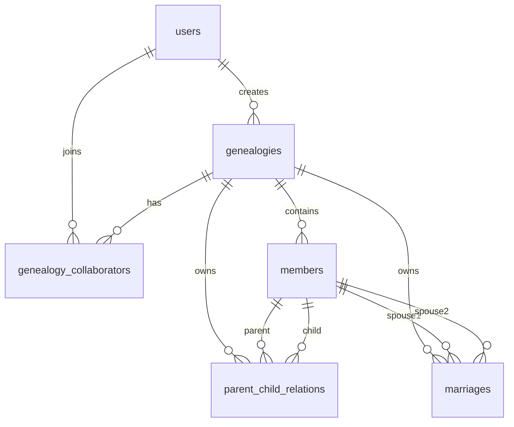

# 数据库设计说明

> 本文档单独说明数据库建模、关系模式、约束、触发器、范式、核心 SQL 和索引设计。适合答辩时配合 ER 图讲解。

---

## 一、设计目标

族谱管理系统需要表达以下信息：

- 系统用户；
- 用户创建的族谱；
- 用户之间的协作维护关系；
- 族谱成员基本信息；
- 成员之间的亲子关系；
- 成员之间的婚姻关系；
- 支持祖先、后代、亲缘路径等查询。

因此数据库设计的核心不是单纯存储成员，而是要能准确表达成员之间的多种关系。

---

## 二、ER 图

ER 图文档位于：

```text
交付物/report/ER图.md
```

Mermaid 图如下：



---

## 三、关系模式

### 1. 用户表 `users`

```text
users(user_id, username, password_hash, created_at)
```

用途：

保存系统用户，用于注册、登录、权限控制。

关键字段：

| 字段 | 说明 |
|---|---|
| `user_id` | 用户主键 |
| `username` | 用户名，唯一 |
| `password_hash` | 密码哈希 |
| `created_at` | 创建时间 |

---

### 2. 族谱表 `genealogies`

```text
genealogies(genealogy_id, title, surname, revision_year, owner_user_id, created_at)
```

用途：

保存族谱基本信息。

关键字段：

| 字段 | 说明 |
|---|---|
| `genealogy_id` | 族谱主键 |
| `title` | 谱名 |
| `surname` | 姓氏 |
| `revision_year` | 修谱年份 |
| `owner_user_id` | 创建用户 |

关系：

```text
genealogies.owner_user_id -> users.user_id
```

---

### 3. 协作者表 `genealogy_collaborators`

```text
genealogy_collaborators(id, genealogy_id, user_id, role)
```

用途：

表示用户和族谱之间的多对多协作关系。

为什么需要这张表：

一个用户可以参与多个族谱，一个族谱也可以有多个协作者，因此需要中间表。

约束：

```text
UNIQUE(genealogy_id, user_id)
```

避免同一个用户被重复邀请到同一个族谱。

---

### 4. 成员表 `members`

```text
members(member_id, genealogy_id, name, gender, birth_year,
        death_year, biography, generation_no)
```

用途：

保存族谱成员的基本信息。

关键字段：

| 字段 | 说明 |
|---|---|
| `member_id` | 成员主键 |
| `genealogy_id` | 所属族谱 |
| `name` | 姓名 |
| `gender` | 性别，`M` 或 `F` |
| `birth_year` | 出生年份 |
| `death_year` | 去世年份，可为空 |
| `biography` | 生平简介 |
| `generation_no` | 代际 |

设计说明：

成员表只保存成员自身属性，不保存父亲、母亲、配偶字段。亲子和婚姻关系拆到独立关系表中。

---

### 5. 亲子关系表 `parent_child_relations`

```text
parent_child_relations(relation_id, genealogy_id, parent_id, child_id, parent_type)
```

用途：

保存父母和子女之间的关系。

关键字段：

| 字段 | 说明 |
|---|---|
| `parent_id` | 父母成员 ID |
| `child_id` | 子女成员 ID |
| `parent_type` | `father` 或 `mother` |

设计说明：

亲子关系拆表后，可以方便查询：

- 某个成员的子女；
- 某个成员的父母；
- 某个成员的所有祖先；
- 某个成员的所有后代。

---

### 6. 婚姻关系表 `marriages`

```text
marriages(marriage_id, genealogy_id, spouse1_id, spouse2_id, married_year)
```

用途：

保存配偶关系。

设计说明：

婚姻关系是两个成员之间的关系，单独建表比放在成员表中更符合规范化。

---

## 四、主键和外键

| 表 | 主键 | 外键 |
|---|---|---|
| `users` | `user_id` | 无 |
| `genealogies` | `genealogy_id` | `owner_user_id -> users.user_id` |
| `genealogy_collaborators` | `id` | `genealogy_id -> genealogies.genealogy_id`, `user_id -> users.user_id` |
| `members` | `member_id` | `genealogy_id -> genealogies.genealogy_id` |
| `parent_child_relations` | `relation_id` | `parent_id -> members.member_id`, `child_id -> members.member_id` |
| `marriages` | `marriage_id` | `spouse1_id -> members.member_id`, `spouse2_id -> members.member_id` |

外键都用于保证引用完整性。例如，如果某个成员不存在，就不能建立以他为父母、子女或配偶的关系。

---

## 五、约束设计

### 1. 唯一约束

| 约束 | 作用 |
|---|---|
| `users.username UNIQUE` | 避免用户名重复 |
| `genealogy_collaborators(genealogy_id, user_id)` | 避免重复协作 |
| `parent_child_relations(genealogy_id, parent_id, child_id, parent_type)` | 避免重复亲子关系 |
| `marriages(genealogy_id, spouse1_id, spouse2_id)` | 避免重复婚姻关系 |

### 2. CHECK 约束

| 约束 | 作用 |
|---|---|
| `gender IN ('M', 'F')` | 限制性别取值 |
| `death_year IS NULL OR birth_year <= death_year` | 保证死亡年份不早于出生年份 |
| `parent_id <> child_id` | 禁止自己成为自己的父母 |
| `spouse1_id <> spouse2_id` | 禁止自己和自己建立婚姻 |

---

## 六、触发器设计

触发器脚本：

```text
交付物/sql/triggers.sql
```

### 1. 亲子关系触发器

触发器：

```text
trg_validate_parent_child
```

调用函数：

```text
fn_validate_parent_child()
```

校验内容：

- 父母和子女必须存在；
- 父母和子女必须属于同一族谱；
- `father` 关系要求父节点性别为男；
- `mother` 关系要求父节点性别为女；
- 父母出生年份必须早于子女出生年份。

为什么用触发器：

这些规则需要查询 `members` 表，普通 CHECK 约束不能跨表查询，所以使用触发器。

### 2. 婚姻关系触发器

触发器：

```text
trg_validate_marriage
```

调用函数：

```text
fn_validate_marriage()
```

校验内容：

- 配偶双方必须存在；
- 配偶双方必须属于同一族谱。

---

## 七、范式分析

本系统满足第三范式。

### 1. 第一范式

所有字段都是原子值。例如成员姓名、性别、出生年、代际都单独存储，没有在一个字段中存多个值。

### 2. 第二范式

每张表都有明确主键，非主属性完全依赖主键。例如 `members` 中的姓名、性别、生卒年都依赖 `member_id`。

### 3. 第三范式

非主属性不依赖其他非主属性。例如族谱的姓氏和修谱年份只依赖 `genealogy_id`，不会通过成员信息间接决定。

### 4. 拆分关系表的规范化意义

如果把父亲、母亲、配偶直接放在成员表中，会导致：

- 成员表承担太多关系信息；
- 配偶关系难以表达多个历史婚姻；
- 亲子关系查询和递归查询不方便；
- 关系重复和更新异常风险更高。

拆成 `parent_child_relations` 和 `marriages` 后，成员实体和成员关系分离，结构更清晰。

---

## 八、核心 SQL 查询

核心 SQL 文件：

```text
交付物/sql/queries.sql
```

包含以下查询：

| 编号 | 查询 | 技术点 |
|---|---|---|
| 1 | 给定成员 ID，查询其配偶及所有子女 | JOIN + UNION ALL |
| 2 | 递归查询所有祖先 | WITH RECURSIVE |
| 3 | 平均寿命最长的一代人 | GROUP BY + AVG |
| 4 | 年龄超过 50 岁且没有配偶的男性 | NOT EXISTS |
| 5 | 出生年份早于本代平均出生年份的成员 | 分组统计 + JOIN |
| 6 | 四代后代查询 | WITH RECURSIVE + 性能测试 |

---

## 九、索引设计

索引脚本：

```text
交付物/sql/indexes.sql
```

### 1. 成员查询索引

```sql
CREATE INDEX IF NOT EXISTS idx_members_genealogy_name
    ON members (genealogy_id, name);
```

用途：

优化族谱内按姓名查询。

### 2. 代际查询索引

```sql
CREATE INDEX IF NOT EXISTS idx_members_generation
    ON members (genealogy_id, generation_no);
```

用途：

优化按代际统计和筛选。

### 3. 亲子关系索引

```sql
CREATE INDEX IF NOT EXISTS idx_parent_child_parent
    ON parent_child_relations (genealogy_id, parent_id);

CREATE INDEX IF NOT EXISTS idx_parent_child_child
    ON parent_child_relations (genealogy_id, child_id);
```

用途：

- `parent_id` 索引用于查子女和后代；
- `child_id` 索引用于查父母和祖先。

### 4. 婚姻关系索引

```sql
CREATE INDEX IF NOT EXISTS idx_marriages_spouse1
    ON marriages (genealogy_id, spouse1_id);

CREATE INDEX IF NOT EXISTS idx_marriages_spouse2
    ON marriages (genealogy_id, spouse2_id);
```

用途：

优化从任一配偶查找婚姻关系。

### 5. 模糊搜索索引

```sql
CREATE EXTENSION IF NOT EXISTS pg_trgm;

CREATE INDEX IF NOT EXISTS idx_members_name_trgm
    ON members USING gin (name gin_trgm_ops);
```

用途：

优化 `%关键字%` 形式的姓名模糊搜索。

---

## 十、性能测试结论

性能测试文档：

```text
交付物/report/性能测试记录.md
```

测试查询：

四代后代查询。

测试结果：

| 场景 | 执行时间 |
|---|---:|
| 无索引访问方式 | 92.544 ms |
| 有索引访问方式 | 3.292 ms |
| 提升倍数 | 约 28.11 倍 |

结论：

`parent_child_relations(genealogy_id, parent_id)` 对后代递归查询非常关键。建立索引后，数据库可以直接根据父节点定位子节点，避免重复扫描大范围关系表。

---
